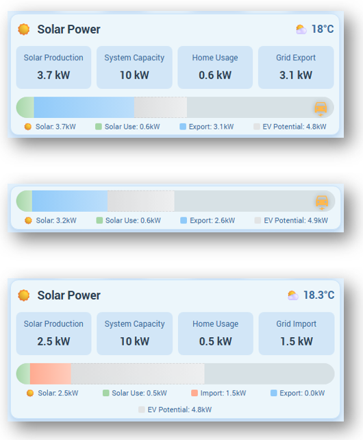

# ☀️ Solar Bar Card for Home Assistant

*Visualize your solar power distribution with an intuitive, real-time bar chart. Perfect for monitoring production, consumption, exports, and EV charging at a glance!*


[](https://github.com/0xAHA/solar-bar-card/issues)
[](https://github.com/0xAHA/solar-bar-card)

 

---

## ✨ Features

### 🎨 Visual Power Distribution

- **Color-coded bar** showing real-time power allocation
- **Green** for solar self-consumption
- **Red** for grid import (when consuming more than solar produces)
- **Blue** for grid export
- **Soft amber** for active EV charging
- **Grey** for potential EV charging capacity
- **Semi-transparent** for unused inverter capacity
- **Yellow dotted line** for solar forecast

### 🌙 Smart Idle Detection

- Automatically detects when solar system is in standby mode
- Shows "Solar system in standby mode" message
- Prevents displaying stale data overnight

### 🚗 Intelligent EV Charger Support

- Show potential charging capacity (smart calculation accounts for current export)
- Display actual charging power when actively charging
- EV potential only shows additional power needed beyond current export

### 🌤️ Weather Integration

- Dynamic weather icons (☀️ sunny, 🌧️ rainy, ⛈️ stormy, etc.)
- Supports both weather entities and temperature sensors
- Displays in top-right corner

### 📊 Solar Forecast

- Integration with Solcast (auto-detection)
- Support for custom forecast sensors
- Visual lightning bolt indicator on bar

### 🎛️ Flexible Display

Toggle any component on/off:

- Header with title
- Individual power statistics (4 tiles)
- Power distribution label
- Color-coded legend with values
- Weather/temperature display
- Bar segment values

### 📱 Responsive Design

- Adapts to Sections view
- Works in Masonry view
- Dynamic card sizing
- Mobile-friendly

---

## 🚀 Installation

### Method 1: HACS (Recommended)

[](https://my.home-assistant.io/redirect/hacs_repository/?owner=0xAHA&repository=solar-bar-card&category=dashboard)

1. Open **HACS** in your Home Assistant instance
2. Click on **Frontend**
3. Click the **⋮** menu and select **Custom repositories**
4. Add repository URL: `https://github.com/0xAHA/solar-bar-card`
5. Category: **Lovelace**
6. Click **Install**
7. Restart Home Assistant

### Method 2: Manual Installation

1. Download `solar-bar-card.js` from [latest release](https://github.com/0xAHA/solar-bar-card/releases)
2. Copy to `<config>/www/solar-bar-card.js`
3. Add resource to dashboard:
   ```yaml
   resources:
     - url: /local/solar-bar-card.js
       type: module
   ```
4. Restart Home Assistant

---

## 🎯 Quick Start

### Basic Setup

```yaml
type: custom:solar-bar-card
inverter_size: 10
production_entity: sensor.solar_production_power
self_consumption_entity: sensor.home_consumption
export_entity: sensor.grid_export_power
import_entity: sensor.grid_import_power
```

### Full Featured Setup

```yaml
type: custom:solar-bar-card
inverter_size: 10
production_entity: sensor.solar_production_power
self_consumption_entity: sensor.home_consumption
export_entity: sensor.grid_export_power
import_entity: sensor.grid_import_power
show_header: true
header_title: "Solar Power"
show_weather: true
weather_entity: weather.home
show_stats: true
show_legend: true
show_legend_values: true
show_bar_values: false
ev_charger_sensor: sensor.ev_charger_power
car_charger_load: 7.4
use_solcast: true
```

---

## ⚙️ Configuration Options


| Option                    | Type    | Default         | Description                                                                                                                   |
| --------------------------- | --------- | ----------------- | ------------------------------------------------------------------------------------------------------------------------------- |
| `inverter_size`           | number  | `10`            | 🔋 Maximum solar system capacity (kW)                                                                                         |
| `production_entity`       | string  | `null`          | ☀️ Solar production power sensor (required)                                                                                 |
| `self_consumption_entity` | string  | `null`          | 🏠 Home power consumption sensor (required)                                                                                   |
| `grid_power_entity`       | string  | `null`          | ⚡ Combined grid sensor (positive=export, negative=import) - overrides separate import/export sensors. (optional/alternative) |
| `export_entity`           | string  | `null`          | ⚡ Grid export power sensor (optional/alternative)                                                                            |
| `import_entity`           | string  | `null`          | 📥 Grid import power sensor (optional/alternative)                                                                            |
| `ev_charger_sensor`       | string  | `null`          | 🔌 Active EV charger power sensor (optional)                                                                                  |
| `car_charger_load`        | number  | `0`             | 🚗 EV charger capacity in kW (for potential display)                                                                          |
| `use_solcast`             | boolean | `false`         | ☁️ Auto-detect Solcast forecast sensor                                                                                      |
| `forecast_entity`         | string  | `null`          | 📈 Solar forecast power sensor                                                                                                |
| `show_header`             | boolean | `false`         | 📝 Display card title                                                                                                         |
| `header_title`            | string  | `"Solar Power"` | 🏷️ Custom title text                                                                                                        |
| `show_weather`            | boolean | `false`         | 🌡️ Display current temperature                                                                                              |
| `weather_entity`          | string  | `null`          | 🌤️ Weather or temperature sensor                                                                                            |
| `show_stats`              | boolean | `false`         | 📊 Display power statistics tiles                                                                                             |
| `show_legend`             | boolean | `true`          | 🎨 Display color-coded legend                                                                                                 |
| `show_legend_values`      | boolean | `true`          | 🔢 Show kW values in legend                                                                                                   |
| `show_bar_label`          | boolean | `true`          | 🏷️ Show power distribution label above bar                                                                                  |
| `show_bar_values`         | boolean | `true`          | 📊 Show kW values on bar segments                                                                                             |

---

## 🎨 Understanding the Bar

### Segments


| Color                    | Meaning                | When Shown                                                 |
| -------------------------- | ------------------------ | ------------------------------------------------------------ |
| 🟢**Green**              | Solar self-consumption | Solar power used by your home                              |
| 🔴**Red**                | Grid import            | Power imported from grid (when home needs more than solar) |
| 🔵**Blue**               | Grid export            | Power sent to the grid                                     |
| 🟠**Soft Amber**         | EV charging (active)   | When EV is actually charging                               |
| ⬜**Light Grey**         | EV potential           | Additional charger capacity available                      |
| 🔳**Semi-transparent**   | Unused capacity        | Available inverter capacity                                |
| ⚡**Yellow dotted line** | Solar forecast         | Predicted solar production                                 |

---

## 🌤️ Weather Integration

### Weather Entity (Dynamic Icons)

```yaml
show_weather: true
weather_entity: weather.home
```

**Supported weather states:**

- ☀️ Sunny
- ⛅ Partly cloudy
- ☁️ Cloudy
- 🌦️ Rainy
- 🌧️ Pouring
- ⛈️ Thunderstorm
- 🌨️ Snowy
- 🌫️ Fog
- 💨 Windy
- 🌙 Clear night

### Temperature Sensor (Thermometer Icon)

```yaml
show_weather: true
weather_entity: sensor.outdoor_temperature
```

---

## 🚗 EV Charger Integration

### Potential Capacity (Grey Bar)

Shows what *could* be used for EV charging:

```yaml
car_charger_load: 7.4
```

The grey bar intelligently shows only the **additional** power needed beyond what's currently being exported. For example, if you're exporting 2kW and have a 7.4kW charger, only 5.4kW grey bar is shown.

### Active Charging (Colored Bar)

Displays actual power when charging:

```yaml
car_charger_load: 7.4
ev_charger_sensor: sensor.ev_charger_power
```

When `ev_charger_sensor` reports > 0W, the EV power is already included in consumption, so no separate segment appears.

---

## 📈 Solar Forecast Integration

### Solcast (Auto-Detection)

```yaml
use_solcast: true
```

Automatically finds Solcast forecast sensors like:

- `sensor.solcast_pv_forecast_power_now`
- `sensor.solcast_forecast_power_now`
- `sensor.solcast_power_now`

**Note:** The forecast indicator only appears when the forecasted power exceeds your current production.

### Custom Forecast

```yaml
forecast_entity: sensor.your_forecast_power_sensor
```

The forecast appears as a **yellow vertical dotted line with lightning bolt** (⚡) showing predicted solar production.

---

## 🔧 Troubleshooting

### 💥 Card Not Appearing

1. **Clear browser cache:** `Ctrl+Shift+R` (Windows) or `Cmd+Shift+R` (Mac)
2. **Verify resource:** Developer Tools → Resources
3. **Check console:** F12 → Console tab for errors

### ❌ Wrong Values Displayed

- ✅ Ensure sensors report in **W** or **kW** units
- ✅ Card automatically converts W → kW
- ✅ Verify entity IDs are correct
- ✅ Check that `production_entity` is a power sensor (not energy/kWh)
- ✅ Import sensor is optional but recommended for accurate grid import display

### 📊 Using Cumulative Sensors (kWh)

If your inverter only provides **total energy** sensors, create derivative helpers:

1. **Settings** → **Devices & Services** → **Helpers**
2. **Create Helper** → **Derivative**
3. Configure:
   - **Input sensor:** Your cumulative sensor
   - **Time window:** 5 minutes
   - **Unit time:** Hours
4. Use the derivative sensor in your card config

This converts kWh accumulation → instantaneous kW power!

---

## 🎯 Example Configurations

### Minimalist

```yaml
type: custom:solar-bar-card
inverter_size: 10
production_entity: sensor.solar_production_power
self_consumption_entity: sensor.home_consumption
export_entity: sensor.grid_export_power
show_legend: false
show_bar_label: false
show_bar_values: false
```

### Dashboard Hero

```yaml
type: custom:solar-bar-card
inverter_size: 13.2
production_entity: sensor.solar_production_power
self_consumption_entity: sensor.home_consumption
export_entity: sensor.grid_export_power
import_entity: sensor.grid_import_power
show_header: true
header_title: "🏡 Home Solar"
show_weather: true
weather_entity: weather.forecast_home
show_stats: true
show_legend: true
show_legend_values: true
show_bar_values: false
ev_charger_sensor: sensor.wallbox_power
car_charger_load: 11
use_solcast: true
```

### EV Focus

```yaml
type: custom:solar-bar-card
inverter_size: 10
production_entity: sensor.solar_production_power
self_consumption_entity: sensor.home_load
export_entity: sensor.grid_export
import_entity: sensor.grid_import
show_header: true
header_title: "⚡ Solar + EV"
ev_charger_sensor: sensor.ev_charger_power
car_charger_load: 7.4
show_legend: true
show_stats: true
show_bar_values: false
```

---

## 🤝 Contributing

Contributions welcome! Feel free to:

- 🐛 Report bugs
- 💡 Suggest features
- 🔧 Submit pull requests

Please [open an issue](https://github.com/0xAHA/solar-bar-card/issues) for discussion first.

---

## 📝 License

MIT License - see LICENSE file for details

---

## 🙏 Credits

- Inspired by the **pool-monitor-card**
- Built for the **Home Assistant** community
- Maintained by [@0xAHA](https://github.com/0xAHA)

---

## 📊 Version History

**v1.0.2** (Current)

- ✨ Manual entity configuration (removed Growatt auto-detection)
- 📥 Added grid import sensor support
- 🌙 Idle/standby state detection
- 🎨 Softer color scheme (amber EV charging)
- 📊 Toggle for bar segment values
- 🧮 Smart EV potential calculation (accounts for export)
- ⚡ Improved Solcast integration (uses power_now sensor)
- 📏 Tighter vertical spacing for better layout
- 🔧 Refined stats tiles (shows either import OR export)

**v1.0.0**

- ✨ Initial release
- 🚗 EV charger support
- 🌤️ Weather integration
- 📈 Solar forecast display
- 🎨 Fully customizable display

---

**Made with ☀️ for the Home Assistant community**
